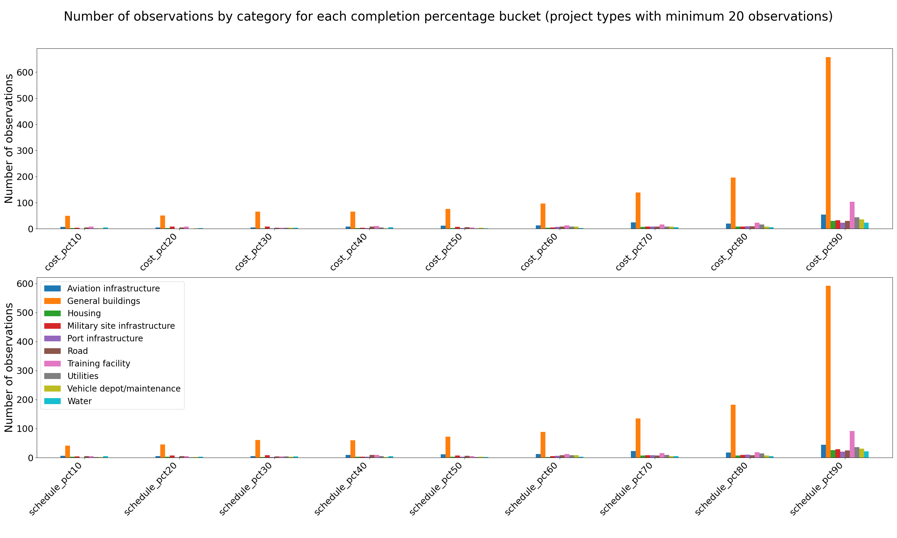
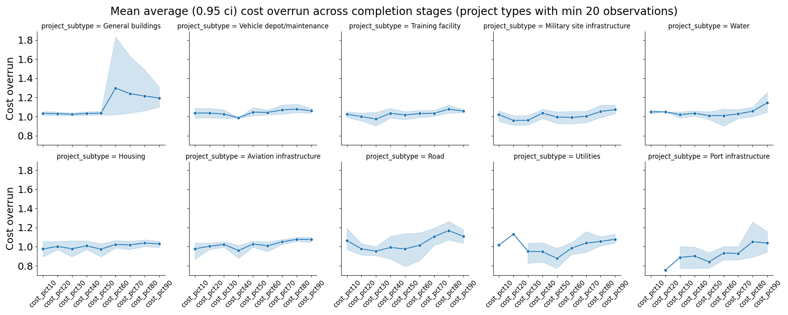
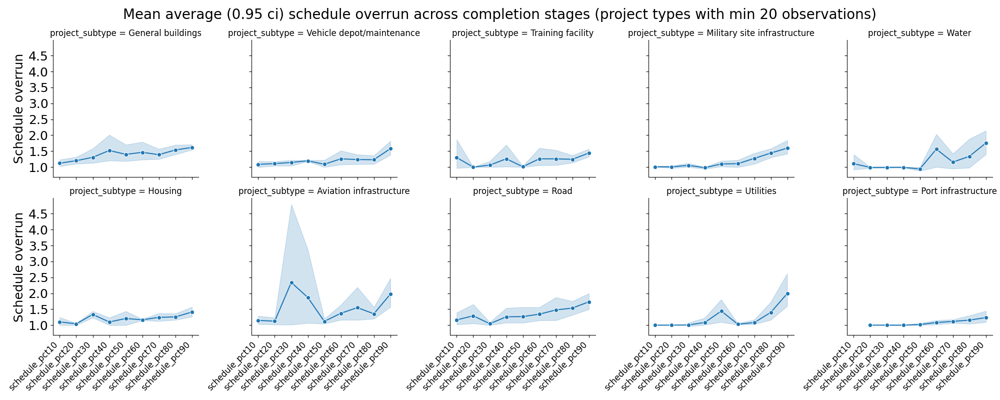
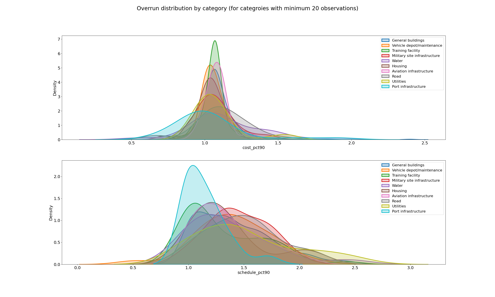
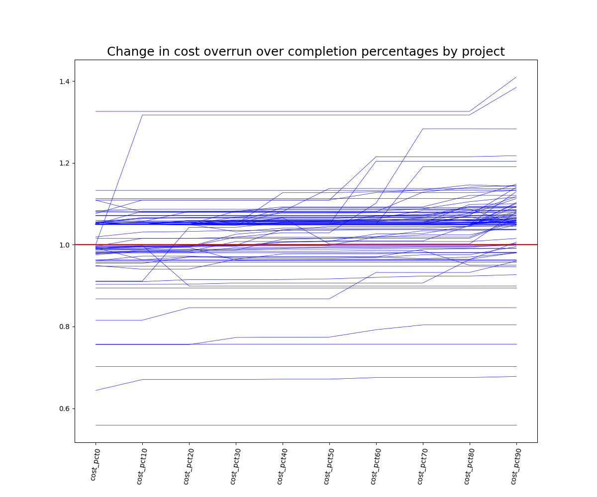
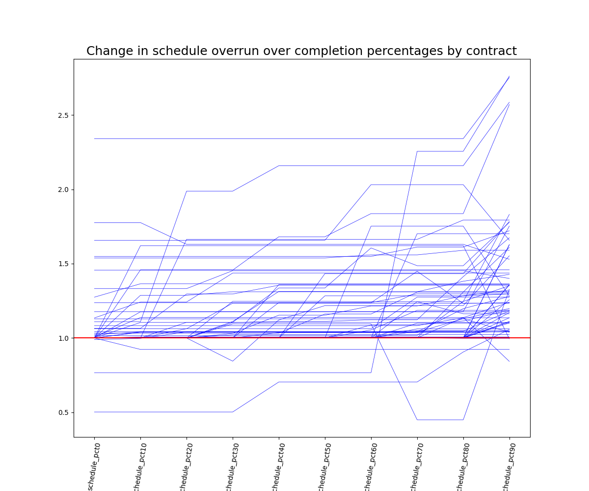
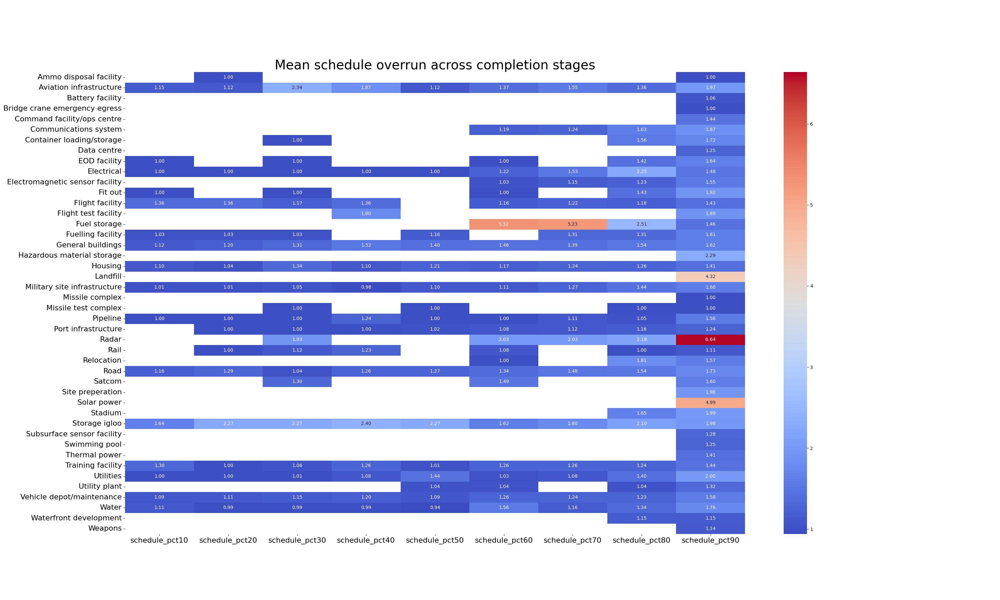
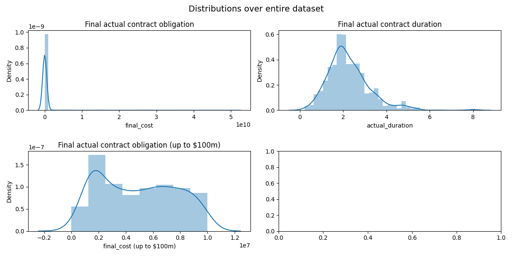

## Introduction

This repo is desgined to produce a dataset from the raw files in `data/raw_data`

These raw files contain updates about cost and schedule for construction contracts awarded by the US DoD.

The dataset produced in this repo summarises these updates into a single row. There are 1188 rows in the final dataset, meaning 1188 different contracts with data from various points of progress in the contract works.

The raw files are taken from the US department of defence public website. https://www.acq.osd.mil/eie/imr/mc/library.html

## Contents of readme

- Directory: Guide to the layout of files in the repo

- Dataset: This section contains descriptions and visualisations of the final dataset

- Methodology: Sets out issues encountered within the data and what assumptions were made.

## Directory

### `notebooks`

- `01: Extract Dataset From Raw Sheets.ipynb` - This notebook extracts the data from each of the source excel files, and homegnises the column headings. Exports a total
sheet of all rows of data.

- `02: Explore raw data structure.ipynb` - This notebook takes a closer look at the available features in the data, and reduces the set to contracts that can be uniquely
identified. (i.e., removing rows where it is vague wether or not multiple rows belong to the same contract, or different ones)

- `03: Create dataset for analysis.ipynb` - This notebook takes the unique contracts (after they had been manually coded into subtype and subtype 2) and "pivots" them, such
that each row matches to a single contract, where cost and schedule updates are included in different columns. In this notebook, outliers or nonsensical data points 
(such as negative durations) are inspected and sometimes trimmed from the dataset.

- `04: Descriptive analysis.ipynb` - Visualisations and descriptive statistics on the final dataset.

### `data`

#### `datasets`

- `all-contracts.csv` - Total full dataset after scraping together from raw milcon files
- `all-unique-contracts.csv` - Dataset with vaguely named contracts removed, leaving contracts which we can be sure are unique
- `unique-contracts-coded.xlsx` - Spreadsheet containing manually encoded categories for each unique contract in `all-unique-contracts-dataset.csv`
- `dataset-for-overrun-analysis.csv` - Final dataset for analysis. All data entries aggregated so that each row reflects a single project, with overrun data at different stages entered in to different columns.

#### `raw_data`

Conatins the full set of raw files downloaded from https://www.acq.osd.mil/eie/imr/mc/library.html

### `plots`

Exports of visulisations produced in analysis that are used in this document.

## Dataset

Final dataset is stored in `./data/datasets/dataset-for-overrun-analysis.csv`.

Each row contains all available information throughout project progress stages for a single contract.

### Columns

| Column | Description |
|--------|-------------|
|`unique_id`| Concatanation of project number and contract title. Uniuqe to each row |
|`project_subtype` | Category of project, i.e. "General buildings", "Training facility", etc |
|`project_subtype_two` | Subcategory of project, i.e. type of building or training facility |
|`archive_filename` | Raw milcon .xlsx file where contract data *first* appeared |
| `start_date` | Start of contract work |
|`estimated_completion_date` | Original contract completion date |
| `actual_completion_date` | Current expected completion date, taken from latest available project update (where "latest" is judged by highest completion percentage) |
|`estimated_duration` | Calculated as the time difference between start date and original completion date |
|`actual_duration` | Calculated as the time difference between start date current expected completion date (where current completion used is from latest project update, determined by completion percentage) |
|`fiscal_year` | Fiscal year for cost information |
|`estimated_cost` | Original contract obligation |
|`estimated_cost_nocontingency` | Original contract obligation, with assumed 5% contingency stripped |
|`final_cost` | Current contract obligation, taken from latest available project update (where "latest" is judged by highest completion percentage) |
|`cost_pct[x]` | 10 columns containing ratios of actual/estimated cost (using estimated cost with contingency stripped). Different columns represent data from different "completion percentage buckets". For instance, data marked between 0-10% completion in `cost_pct0`, data between 10-20% completion in `cost_pct10`, and so on. Thus, the data represent changes in expected spend over stages of project completion. *Note: Where contracts have multiple entries within the same percentage bucket, data with the highest completion percentage was selected to represent that bucket. i.e., if data are available at 18% and 19%, the data at 19% will represent cost overrun at the 10-20% completion bucket* |
|`schedule_pct[x]` | 10 columns containing ratios of actual/estimated durations. Different columns represent data from different "completion percentage buckets". For instance, data marked between 0-10% completion in `schedule_pct0`, data between 10-20% completion in `schedule_pct10`, and so on. Thus, the data represent changes in expected duration over stages of project completion. *Note: Where contracts have multiple entries within the same percentage bucket, data with the highest completion percentage was selected to represent that bucket. i.e., if data are available at 18% and 19%, the data at 19% will represent schedule overrun at the 10-20% completion bucket* |

### Descriptive stats

Describe numerical datapoints

|                              |   count |           mean |         std |           min |            25% |            50% |            75% |            max |
|------------------------------|---------|----------------|-------------|---------------|----------------|----------------|----------------|----------------|
| fiscal_year                  |    1187 | 2010.59        | 1.22887     | 2006          | 2010           | 2011           | 2011           | 2014           |
| estimated_cost               |    1188 |    1.987e+08   | 2.45419e+09 | 1380          |    5.28975e+06 |    1.2181e+07  |    2.50428e+07 |    5.08861e+10 |
| estimated_cost_nocontingency |    1188 |    1.89238e+08 | 2.33732e+09 | 1314.29       |    5.03786e+06 |    1.1601e+07  |    2.38502e+07 |    4.8463e+10  |
| final_cost                   |    1188 |    1.88244e+08 | 2.29714e+09 | 1498          |    5.73075e+06 |    1.27652e+07 |    2.66012e+07 |    5.08474e+10 |
| cost_pct0                    |      96 |    1.00882     | 0.0996458   |    0.559462   |    0.986697    |    1.05        |    1.05        |    1.32597     |
| schedule_pct0                |      80 |    1.06629     | 0.222765    |    0.502479   |    1           |    1           |    1.00916     |    2.34074     |
| cost_pct10                   |      95 |    1.02781     | 0.0827921   |    0.670431   |    0.991412    |    1.05        |    1.05597     |    1.31718     |
| schedule_pct10               |      81 |    1.13503     | 0.338331    |    0.502479   |    1           |    1           |    1.13786     |    2.73485     |
| cost_pct20                   |      95 |    1.0142      | 0.0742292   |    0.755909   |    0.981673    |    1.04253     |    1.05619     |    1.26378     |
| schedule_pct20               |      85 |    1.16934     | 0.350374    |    0.648649   |    1           |    1.03279     |    1.18192     |    2.90625     |
| cost_pct30                   |     119 |    1.01465     | 0.072578    |    0.758068   |    0.985892    |    1.0426      |    1.05597     |    1.14525     |
| schedule_pct30               |     111 |    1.27475     | 0.90023     |    0.502479   |    1           |    1.03968     |    1.24424     |    7.7         |
| cost_pct40                   |     127 |    1.01682     | 0.0982647   |    0.544046   |    0.985117    |    1.0383      |    1.06083     |    1.36359     |
| schedule_pct40               |     115 |    1.42817     | 1.28964     |    0.704132   |    1           |    1.08885     |    1.34547     |   10.7258      |
| cost_pct50                   |     127 |    1.0198      | 0.101476    |    0.548839   |    0.988626    |    1.05        |    1.05701     |    1.37256     |
| schedule_pct50               |     120 |    1.29657     | 0.968411    |    0.648649   |    1           |    1.07172     |    1.27901     |   10.7258      |
| cost_pct60                   |     188 |    1.16661     | 1.86788     |    0.555511   |    0.989667    |    1.05        |    1.07181     |   26.5867      |
| schedule_pct60               |     174 |    1.37616     | 1.00242     |    0.704132   |    1           |    1.10738     |    1.36981     |   10.7258      |
| cost_pct70                   |     257 |    1.14149     | 1.62493     |    0.635297   |    0.989177    |    1.05        |    1.0747      |   27.0264      |
| schedule_pct70               |     244 |    1.37893     | 0.904033    |    0.449807   |    1.03305     |    1.15479     |    1.42788     |   10.7258      |
| cost_pct80                   |     343 |    1.15394     | 1.41381     |    0.672915   |    1.00732     |    1.05723     |    1.10693     |   27.0264      |
| schedule_pct80               |     316 |    1.47903     | 0.885817    |    0.806971   |    1.081       |    1.25295     |    1.52834     |   10.7258      |
| cost_pct90                   |    1188 |    1.16502     | 1.14782     |    0.559462   |    1.0194      |    1.06704     |    1.11981     |   27.3312      |
| schedule_pct90               |    1057 |    1.6433      | 1.10006     |    0.52518    |    1.12857     |    1.37105     |    1.72513     |   14.44        |

### Taxonomy

Table below shows number of contracts where we have cost/schedule overrun taken from between 90-100% completion. Data are split up by category. Most categories have very little data points. The most abundant categories are general buildings and training facility, both of which are sub-divided into sub-categories, as shown on the second table. 

The following tables do *not* reflect the number of contracts which have data at earlier stages of completion. The counts for contracts with this information are much lower, and shown in the next section.

| project_subtype                 |   cost_pct90 |   schedule_pct90 |
|:--------------------------------|-------------:|-----------------:|
| Ammo disposal facility          |            1 |                1 |
| Aviation infrastructure         |           54 |               44 |
| Battery facility                |            1 |                1 |
| Bridge crane emergency egress   |            1 |                1 |
| Command facility/ops centre     |            1 |                1 |
| Communications system           |            5 |                4 |
| Container loading/storage       |            3 |                2 |
| Data centre                     |            2 |                2 |
| EOD facility                    |            5 |                4 |
| Electrical                      |            9 |                9 |
| Electromagnetic sensor facility |            2 |                1 |
| Fit out                         |            1 |                1 |
| Flight facility                 |            9 |                9 |
| Flight test facility            |            1 |                1 |
| Fuel storage                    |           19 |               19 |
| Fuelling facility               |            1 |                1 |
| General buildings               |          658 |              592 |
| Hazardous material storage      |            1 |                1 |
| Housing                         |           30 |               26 |
| Land acquisition                |            4 |                0 |
| Landfill                        |            1 |                1 |
| Military site infrastructure    |           33 |               29 |
| Missile complex                 |            1 |                1 |
| Missile test complex            |            1 |                1 |
| Pipeline                        |           10 |               10 |
| Port infrastructure             |           23 |               21 |
| Radar                           |            4 |                4 |
| Rail                            |            5 |                4 |
| Relocation                      |           10 |               10 |
| Road                            |           30 |               25 |
| Satcom                          |            2 |                2 |
| Site preperation                |            3 |                3 |
| Solar power                     |            2 |                2 |
| Stadium                         |            1 |                1 |
| Storage igloo                   |           14 |               12 |
| Subsurface sensor facility      |            1 |                1 |
| Swimming pool                   |            4 |                3 |
| Thermal power                   |            5 |                5 |
| Training facility               |          103 |               92 |
| Utilities                       |           44 |               36 |
| Utility plant                   |            4 |                4 |
| Vehicle depot/maintenance       |           36 |               31 |
| Water                           |           23 |               22 |
| Waterfront development          |            3 |                3 |
| Weapons                         |            3 |                3 |

The next table (below) shows cost/schedule overrun counts from 90-100% for each subcategory. Some main categories are omitted as they do not have subcategories.

|          project_subtype   |    project_subtype_two                 |   cost_pct90 |   schedule_pct90 |
|:---------------------------|----------------------------------------|-------------:|-----------------:|
| Aviation infrastructure | Aeriel port facility                 |            2 |                2 |
| Aviation infrastructure | Apron                                |           23 |               19 |
| Aviation infrastructure | Apron lighting                       |            1 |                1 |
| Aviation infrastructure | Flight control tower                 |            6 |                5 |
| Aviation infrastructure | Oiling & fuelling                    |           13 |               12 |
| Aviation infrastructure | Runway                               |            5 |                1 |
| Aviation infrastructure | Taxiway                              |            3 |                3 |
| Electrical | Electricity sub-station                           |            3 |                3 |
| Electrical | Energy transmission                               |            6 |                6 |
| General buildings | Administration/office                      |           25 |               24 |
| General buildings | Armory                                     |           10 |                7 |
| General buildings | Barracks                                   |          126 |              112 |
| General buildings | Battalion complex                          |           16 |               16 |
| General buildings | Boat storage building                      |            2 |                2 |
| General buildings | Chemical facility                          |            2 |                2 |
| General buildings | Child care building                        |           35 |               31 |
| General buildings | Church                                     |            4 |                4 |
| General buildings | Command facility/ops centre                |           57 |               53 |
| General buildings | Community centre                           |            5 |                5 |
| General buildings | Emergency dispatch facility                |            8 |                8 |
| General buildings | Engineering/equipment maintenance facility |           44 |               36 |
| General buildings | Fire station                               |           12 |               10 |
| General buildings | Fitness facility                           |           14 |               10 |
| General buildings | Hangar                                     |           45 |               37 |
| General buildings | Hospital                                   |            9 |                9 |
| General buildings | Information systems facility               |            5 |                4 |
| General buildings | Kennels                                    |            8 |                8 |
| General buildings | Lab                                        |           30 |               26 |
| General buildings | Library                                    |            2 |                2 |
| General buildings | Marine resource centre                     |            2 |                2 |
| General buildings | Medical clinic/pharmacy                    |           33 |               33 |
| General buildings | Mess hall                                  |           14 |               12 |
| General buildings | Metal finishing facility                   |            1 |                1 |
| General buildings | Pest management facility                   |            1 |                1 |
| General buildings | Police station                             |            1 |                1 |
| General buildings | Prison                                     |            5 |                5 |
| General buildings | Reserve/readiness centre                   |           41 |               38 |
| General buildings | SCIF                                       |            4 |                2 |
| General buildings | School/classrooms                          |           35 |               34 |
| General buildings | Security facility                          |            4 |                4 |
| General buildings | Warehouse/storage                          |           45 |               40 |
| Military site infrastructure | Access control point            |            4 |                4 |
| Military site infrastructure | Access ramp                     |            2 |                1 |
| Military site infrastructure | Barrier                         |            3 |                3 |
| Military site infrastructure | Beddown                         |            3 |                3 |
| Military site infrastructure | Canopy                          |            1 |                1 |
| Military site infrastructure | Fencing                         |            1 |                1 |
| Military site infrastructure | Flood mitigation                |            1 |                0 |
| Military site infrastructure | Gate                            |            6 |                5 |
| Military site infrastructure | Guard towers                    |            1 |                1 |
| Military site infrastructure | Ordnance loading area           |            1 |                1 |
| Military site infrastructure | Parachute drying tower          |            1 |                1 |
| Military site infrastructure | Storage pads                    |            1 |                1 |
| Military site infrastructure | Vehicle wash rack               |            6 |                5 |
| Military site infrastructure | Window shutters                 |            2 |                2 |
| Pipeline | Fuel pipeline                                       |            3 |                3 |
| Pipeline | Gas pipeline                                        |            1 |                1 |
| Pipeline | Water pipeline                                      |            6 |                6 |
| Port infrastructure | Berthing                                 |            2 |                2 |
| Port infrastructure | Dredging                                 |            2 |                2 |
| Port infrastructure | Mooring dolphins                         |            1 |                0 |
| Port infrastructure | Pier                                     |            7 |                7 |
| Port infrastructure | Ship maintenance facility                |            2 |                1 |
| Port infrastructure | Submarine drive-in                       |            1 |                1 |
| Port infrastructure | Wharf                                    |            8 |                8 |
| Rail | Loading facility                                        |            1 |                1 |
| Rail | Marshalling yard                                        |            2 |                1 |
| Road | Bridge                                                  |            2 |                1 |
| Road | Car park                                                |            4 |                4 |
| Road | Hardstanding                                            |            4 |                3 |
| Road | Marshalling area                                        |            1 |                1 |
| Road | Road                                                    |           19 |               16 |
| Thermal power | Gas power plant                                |            1 |                1 |
| Thermal power | Steam power plant                              |            3 |                3 |
| Training facility | Aviation training complex                  |            4 |                4 |
| Training facility | Battle course                              |           14 |               13 |
| Training facility | Communications training facility           |            1 |                1 |
| Training facility | Flight simulator                           |           18 |               13 |
| Training facility | Gun range                                  |           39 |               39 |
| Training facility | Gun range baffle system                    |            1 |                1 |
| Training facility | Logistics training complex                 |            1 |                0 |
| Training facility | Metals training facility                   |            1 |                1 |
| Training facility | Nuclear/space training                     |            1 |                1 |
| Training facility | Rappel tower                               |            1 |                1 |
| Training facility | SERE training                              |            1 |                1 |
| Training facility | Simulation centre                          |            9 |                7 |
| Training facility | Training complex                           |            8 |                8 |
| Training facility | Vehicle training facility                  |            4 |                2 |
| Utilities | Air conditioning/HVAC                              |            5 |                5 |
| Utilities | Alarm system                                       |            1 |                1 |
| Utilities | Cooling system                                     |            2 |                2 |
| Utilities | Drainage works                                     |            3 |                1 |
| Utilities | Gas & electric                                     |            5 |                4 |
| Utilities | Generator                                          |            5 |                3 |
| Utilities | Heating                                            |            1 |                1 |
| Utilities | Power                                              |            1 |                1 |
| Utilities | Sewage systems                                     |            1 |                1 |
| Utilities | Steam line                                         |            3 |                2 |
| Water | Pump station                                           |            2 |                2 |
| Water | Wastewater treatment                                   |            9 |                8 |
| Water | Water storage tank                                     |            1 |                1 |
| Water | Water treatment                                        |            8 |                8 |
| Water | Well                                                   |            3 |                3 |
| Weapons | THAAD                                                |            2 |                2 |

### Data availability at stages of contract completion

The next graph shows the number of cost/schedule overrun observations we have at each stage of completion for each project category. Generally, the number of observations increases at later stages of completion. The difference within categories is huge, with data at lower stages of completion representing just a fraction of the full category sample. At earlier stages, many project categories have sample sizes which become too small to provide a meaningful sample.

Due to the large number of categroies, the graph below shows only categeories that have a minimum of 20 observations, so as to make it more readable. A full version of this graph is available within the repo at `./notebooks/04: Descriptive analysis.ipynb`.

### Change in overrun ratios across completion stages

The following demonstrates the changes in cost overrun moving forward through completion stages. This comprises a rolling mean of all avialable data at each stage, so for instance a contract with data only at 50-60% completion will be included. This may explain some of the spikes observed at earlier stages, where poor performing projects may not be represented in later stages, or the average may be influenced by the presence of more better performing datapoints.

Again, the graphs have been limited to categroies which have a minimum of 20 observations. Full graphs are available in `./notebooks/04: Descriptive analysis.ipynb`

### Shape of overrun data at 90-100% completion stage

The following shows the distributions of cost and schedule overrun taken from between 90-100% completion. Generally, we see worse performance in schedule overrun, where many categroies are more skewed towards the right. There is also more variance in many of the distributions, indicating that schedule performance is less consistant/varies more significantly than cost.

### Linegraphs

The following graphs show the change in cost and schedule overrun over stages of completion for individual contracts, where each blue line represents an individual contract. The data used consist only in contracts for which we have data at 0-10%. Any missing data are imputed from earlier cells. For instance, a row with: `1 NA NA 1.3 NA NA` will be augmented as `1 1 1 1.3 1.3 1.3`. The red lines on the graph indicated a ratio of 1.0, i.e. on time/on budget.

There are many "flat spots" on the lines, due to missing data. This makes it difficult to discern any patterns. As seen in other visualisations, schedule overruns are generally higher than cost. 

One thing to note is projects whereby cost/schedule overrun amounts *decrease* as time goes on. These are instances where "Current contract obligation" or "Current completion date" decrease at later project updates. The following table is a snippet from the dataset which shows the original data entries (with some columns trimmed) for a project wherein the schedule overrun amount decreases over time. Contract updates where completion percentage is 0.71 have a current completion date of January 2013, which is 10 months earlier than the previous estimate at 31% completion, and 10 months earlier than the original finish date on the contract. The next update, at 97% completion, increases the finish date by about a year.

It is not obvious why this is the case, or whether the data entry were a mistake. 

| archive_filename                            | Submission Date   | Data as of Date   | Project Number   | Start Date   | Placed in Service Date   | Estimated Construction Completion Date   | Actual Construction Completion Date   |   Completion Percentage |
|:--------------------------------------------|:------------------|:------------------|:-----------------|:-------------|:-------------------------|:-----------------------------------------|:--------------------------------------|------------------------:|
| MilCon Status Report - January, 2013.xlsx   | 2013-02-15        | nan               | XDAT083003       | 2012-06-11   | 2013-11-04               | 2013-11-11                               | 2013-11-11                            |                    0.04 |
| MilCon Status Report - March, 2013.xlsx     | 2013-04-15        | nan               | XDAT083003       | 2012-06-11   | 2013-11-04               | 2013-11-11                               | 2013-11-11                            |                    0.18 |
| MilCon Status Report - May, 2013.xlsx       | 2013-06-03        | 2013-05-31        | XDAT083003       | 2012-06-11   | 2013-11-04               | 2013-11-11                               | 2013-11-11                            |                    0.27 |
| MilCon Status Report - September, 2013.xlsx | 2013-10-07        | 2013-09-30        | XDAT083003       | 2012-06-11   | 2013-12-04               | 2013-11-11                               | 2013-12-30                            |                    0.31 |
| MilCon Status Report - July, 2013.xlsx      | 2013-08-06        | 2013-07-31        | XDAT083003       | 2012-06-11   | 2013-12-04               | 2013-11-11                               | 2013-12-23                            |                    0.31 |
| MilCon Status Report - August, 2013.xlsx    | 2013-09-04        | 2013-08-31        | XDAT083003       | 2012-06-11   | 2013-12-04               | 2013-11-11                               | 2013-12-23                            |                    0.31 |
| MilCon Status Report - June, 2013.xlsx      | 2013-07-02        | 2013-06-30        | XDAT083003       | 2012-06-11   | 2013-11-04               | 2013-11-11                               | 2013-11-11                            |                    0.31 |
| MilCon Status Report - November, 2013.xlsx  | 2013-12-04        | 2013-11-30        | XDAT083003       | 2012-06-11   | 2013-01-14               | 2013-11-11                               | 2013-01-30                            |                    0.71 |
| MilCon Status Report - January, 2014 .xlsx  | 2014-02-19        | 2014-01-31        | XDAT083003       | 2012-06-11   | 2013-01-14               | 2013-11-11                               | 2013-01-30                            |                    0.71 |
| MilCon Status Report - February, 2014 .xlsx | 2014-03-10        | 2014-02-28        | XDAT083003       | 2012-06-11   | 2013-01-14               | 2013-11-11                               | 2013-01-30                            |                    0.71 |
| MilCon Status Report - March, 2014 .xlsx    | 2014-04-04        | 2014-03-31        | XDAT083003       | 2012-06-11   | 2014-04-11               | 2013-11-11                               | 2014-04-15                            |                    0.97 |
| MilCon Status Report - May, 2014 .xlsx      | 2014-06-05        | 2014-05-31        | XDAT083003       | 2012-06-11   | 2014-04-17               | 2013-11-11                               | 2014-04-29                            |                    0.97 |
| MilCon Status Report - June, 2014 .xlsx     | 2014-07-08        | 2014-06-30        | XDAT083003       | 2012-06-11   | 2014-04-17               | 2013-11-11                               | 2014-04-29                            |                    0.97 |
| MilCon Status Report - April, 2014 .xlsx    | 2014-05-05        | 2014-04-30        | XDAT083003       | 2012-06-11   | 2014-04-17               | 2013-11-11                               | 2014-04-29                            |                    0.97 |
| MilCon Status Report - July, 2014 .xlsx     | 2014-08-04        | 2014-07-31        | XDAT083003       | 2012-06-11   | 2014-04-18               | 2013-11-11                               | 2014-04-29                            |                    0.99 |
| MilCon Status Report - August, 2014 .xlsx   | 2014-09-05        | 2014-08-31        | XDAT083003       | 2012-06-11   | 2014-04-10               | 2013-11-11                               | 2014-04-29                            |                    1    |

We see similar occurences with cost overrun amounts. The following snippet contains data on a project where the current contract obligation (actual cost) fluctuates above and below the original contract amount throughout project completion stages. 

| archive_filename                             | Submission Date   | Data as of Date   |   Project Number | Start Date   |   Estimated Cost |   Actual Cost |   Estimated Cost (exc. contingency) |   Completion Percentage |
|:---------------------------------------------|:------------------|:------------------|-----------------:|:-------------|-----------------:|--------------:|------------------------------------:|------------------------:|
| MilCon Status Report - January, 2013.xlsx    | 2013-02-15        | nan               |             1094 | 2010-10-12   |       7.3986e+07 |    6.076e+07  |                         7.04629e+07 |                0.64     |
| MilCon Status Report - March, 2013.xlsx      | 2013-04-15        | nan               |             1094 | 2010-10-12   |       7.3986e+07 |    6.5966e+07 |                         7.04629e+07 |                0.64     |
| MilCon Status Report - May, 2013.xlsx        | 2013-06-12        | 2013-05-31        |             1094 | 2010-10-12   |       7.3986e+07 |    6.8178e+07 |                         7.04629e+07 |                0.691087 |
| MilCon Status Report - August, 2013.xlsx     | 2013-09-05        | 2013-08-31        |             1094 | 2010-10-12   |       7.3986e+07 |    6.8186e+07 |                         7.04629e+07 |                0.716215 |
| MilCon Status Report - June, 2013.xlsx       | 2013-07-02        | 2013-06-30        |             1094 | 2010-10-12   |       7.3986e+07 |    6.8183e+07 |                         7.04629e+07 |                0.720622 |
| MilCon Status Report - November, 2013.xlsx   | 2013-12-05        | 2013-11-30        |             1094 | 2010-10-12   |       7.3986e+07 |    6.8975e+07 |                         7.04629e+07 |                0.799141 |
| MilCon Status Report - February, 2014 .xlsx  | 2014-03-06        | 2014-02-28        |             1094 | 2010-10-12   |       7.3986e+07 |    7.0118e+07 |                         7.04629e+07 |                0.84111  |
| MilCon Status Report - September, 2013.xlsx  | 2013-10-07        | 2013-09-30        |             1094 | 2010-10-12   |       7.3986e+07 |    6.8374e+07 |                         7.04629e+07 |                0.842262 |
| MilCon Status Report - March, 2014 .xlsx     | 2014-04-07        | 2014-03-31        |             1094 | 2010-10-12   |       7.3986e+07 |    7.0148e+07 |                         7.04629e+07 |                0.85896  |
| MilCon Status Report - April, 2014 .xlsx     | 2014-05-06        | 2014-04-30        |             1094 | 2010-10-12   |       7.3986e+07 |    7.1876e+07 |                         7.04629e+07 |                0.864663 |
| MilCon Status Report - May, 2014 .xlsx       | 2014-06-05        | 2014-05-31        |             1094 | 2010-10-12   |       7.3986e+07 |    7.1882e+07 |                         7.04629e+07 |                0.871497 |
| MilCon Status Report - August, 2014 .xlsx    | 2014-09-16        | 2014-08-31        |             1094 | 2010-10-12   |       7.3986e+07 |    7.465e+07  |                         7.04629e+07 |                0.885776 |
| MilCon Status Report - September, 2014 .xlsx | 2014-10-03        | 2014-09-30        |             1094 | 2010-10-12   |       7.3986e+07 |    7.8735e+07 |                         7.04629e+07 |                0.894519 |
| MilCon Status Report - June, 2014 .xlsx      | 2014-07-07        | 2014-06-30        |             1094 | 2010-10-12   |       7.3986e+07 |    7.4422e+07 |                         7.04629e+07 |                0.910088 |
| MilCon Status Report - July, 2014 .xlsx      | 2014-08-04        | 2014-07-31        |             1094 | 2010-10-12   |       7.3986e+07 |    7.4432e+07 |                         7.04629e+07 |                0.917061 |
| MilCon Status Report - January, 2014 .xlsx   | 2014-02-05        | 2014-01-31        |             1094 | 2010-10-12   |       7.3986e+07 |    6.9179e+07 |                         7.04629e+07 |                0.922575 |

### Heatmaps

The following heatmaps provide more information about cost overruns by category. For each heatmap, we can see which categories have data at which stages of completions, as well as an average value for that category at that stage.

### Additional statistics distributions

Breakdowns of actual cost and schedule distributions can be found in `./notebooks/04: Descriptive analysis.ipynb`

## Methodology

### Features from the raw data not included in the final dataset

These features *can* be found in other datasets, i.e. in `unique-contracts-coded.xlsx`

- **Submission date:** to do with when the data are relevent for I think (i.e. when collected/recorded)

- **Data as of date:** to do with when the data are relevent for I think (i.e. when collected/recorded)

- **Component:** to do with sector I think. i.e., "Army", "Air force", etc.

- **Project type:** category, usually with "minor" or "major" contruction, although some other instances include: "family housing", "brac"

- **Country/state code:** Country code (iso3) or state code, i.e. california = CA

- **Country/state name:** Name of country or state

- **Installation:** Where the work was done, i.e. "Pentagon"

- **Solicitation date:**

### Unique IDs

Contract information will be updated throughout multiple raw files. For this reason, unique IDs needed to be constructed out of contract data so that individual contracts could be tracked and identified throughout multiple updates. 

#### Problems:
- Raw data contains information on projects *and* contracts, where there may be many contracts associated with a single project. For this reason "project number" is not a sufficient distinction between contracts.
- "Project title" is generic in many cases - i.e., the same project titles will be reused for contracts with different project numbers. So, project title is also not sufficient for a unique identifier of contracts

#### Solution:
- Remove all data that do not have project numbers
- Produce unique ID by concatenating project number and title
- Remove all unique IDs which have changing estimated costs or estimated completions
- This leaves the dataset with unique IDs that are matched to a single set of cost and schedule estimates

### Completion percentage

The completion percentage appears to be a measure of work done. It does not align to the dates that the data were recorded (which I use "data as of date" and "submission date")
as indicators relative to the contract award date, solicitation date or construction start date, and the current end date of the contract or the placed in service date. **This
means that the percentage complete values do not appear to be calculations from the other data features.**

For raw data published pre-2016, completion percentage amounts were recorded for each contract. However, from 2016, only entire projects had a completion percentage 
recorded for them. This means we do not know the completion percentage of the individual contracts, if there are multiple associated with a project.

#### Problems
- We can only know the completion percentage of a contract if there are no other contracts associated with the project post-2015, OR
- if the project is 100% complete, we can assume the associated contracts are also 100% complete.

#### Solution
- All data with completion of 100% have been saved
- All projects associated with a single contract have been saved
- Complete contract data pre-2015 has been saved
- All other datapoints are omitted from the final dataset

### Dates

In general, the dates go in the following order (bar some anomolies):

1. Solicitation date
2. Award date
3. Start date
4. Completion date
5. Placed in service date
6. Data as of date
7. Submission date

The biggest ambiguities in this are with:

- "Data as of Date" and "Submission date", where in 36% of cases submission date comes before data as of date.

- "Placed in service date" and "Actual completion date" where in 31% of cases, completion date comes after placed in service date. 

- There are variations in which came first out of "data as of date" and "place in service date", but this makes sense as we have data both during and after projects

### Fiscal year

The fiscal year is usually consistent with the year of the solicitation date. It never changes throughout project updates, even as the "data as of date" 
advances throughout the years. Therefore it is assumed that all reported costs adhere to this cost year.

### Removing outliers

Some projects contained:
- Overrun ratios of greater than 100
- negative durations (because start dates are later completion dates)

This was the case in a tiny handful of projects - so these have just been removed, assuming that they are errors. The details of this process and examples from the data are
available in `notebooks/03: Create dataset for analysis.ipynb`

### Contingency

5% contingency is assumed to be included within the contract original budgets. So this 5% is manually stripped from the original contract amounts 
before cost overruns are calculated. 
